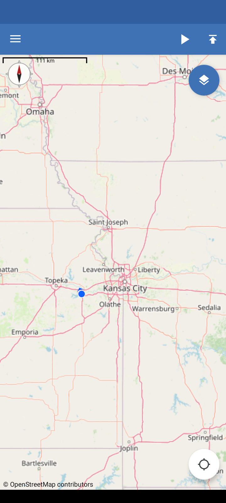
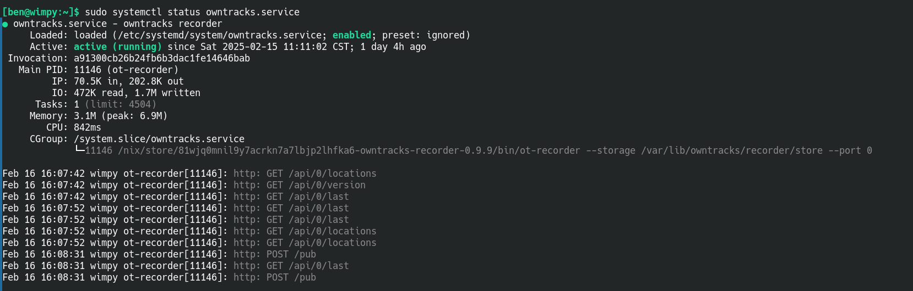

Title: OwnTracks with NixOS and Tailscale
Date: 2025-02-15

In an effort to reduce my reliance on big tech I recently decided to
try using [OwnTracks](https://owntracks.org/) to replace Google Maps
Timeline. This article provides a rundown of how I accomplished this
using an existing home server running NixOS and my existing Tailnet.


## Impetus

For various reasons I find it useful to be able to review my past
whereabouts, and Google Timeline has worked fairly well for this
purpose. At some point Google changed Timeline to only store location
history on the mobile device, removing it from the Maps web app. I've
also found that the UI for Timeline on my phone has become laggy and
feels like it could fail at any time. These seem like warning signs
that Google may be neglecting the service or that it may be dropped
entirely.

To hedge against that possibility and in furtherance of my general
goal of reducing dependence on big tech, I've decided try replacing
this service with OwnTracks.

## OwnTracks

OwnTracks consists of a few components, including mobile apps for
Android and iOS that send location updates to a server. The server can
either be an MQTT broker or the OwnTracks Recorder. Using an MQTT
broker permits live location sharing among devices running the
app. Since I only care about recording my location history, I can
forgo the MQTT broker and set the app up to publish updates directly
to the recorder via HTTP.

The [OwnTracks
Recorder](https://owntracks.org/booklet/clients/recorder/) acts as a
database to store location histories published by the mobile apps. It
also provides APIs for querying the stored histories.

There is also an [OwnTracks
Frontend](https://github.com/owntracks/frontend) which provides a web
app for viewing the stored location histories from the Recorder
service.

## Tailscale

[Tailscale](https://tailscale.com/) is a peer-to-peer VPN
solution. Since I already have Tailscale set up on my home server and
my phone, I can avoid a lot of fiddly work securing (in both senses of
the word) a publicly available IP address for my server. As long as my
phone is connected to my Tailscale VPN, known as a Tailnet, my phone
can directly connect to the server.

## Running the OwnTracks Recorder

I added a systemd service declaration to my NixOS configuration on my
server to run the OwnTracks Recorder service. To avoid running the
service with root privileges I'm using the [dynamic
user](https://noise.getoto.net/2017/10/06/dynamic-users-with-systemd/)
facility provided by systemd which automatically creates an
unprivileged user to run the process. The `StateDirectory` directive
causes a directory to be created under `/var/lib` with permissions
allowing the service to store its persistent state (the location
histories, in this case) across restarts.

Since OwnTracks Recorder has been [packaged for
NixOS](https://github.com/NixOS/nixpkgs/blob/nixos-unstable/pkgs/by-name/ow/owntracks-recorder/package.nix)
I can reference the package directly to invoke the service. Since I'm
using the unstable channel, the package includes [this recent
commit](https://github.com/NixOS/nixpkgs/commit/7ebad821473c78c7cfdf17ecf9f9be91d2455d81)
which fixes the HTTP mode for the service. The fix should be included
in the next stable release of NixOS.

When the executable is invoked, it is provided with the path to the
state directory via the `--storage` flag. The `--port 0` flag tells
Recorder not to try to connect to an MQTT broker. I leave the HTTP
port at the default 8083. Other command line options are in the
[documentation](https://github.com/owntracks/recorder?tab=readme-ov-file#ot-recorder-options).

```nix
  systemd.services.owntracks = {
    enable = true;
    description = "owntracks recorder";
    serviceConfig = {
      ExecStart = ''
        ${pkgs.owntracks-recorder}/bin/ot-recorder \
           --storage /var/lib/owntracks/recorder/store \
           --port 0
        '';
      DynamicUser = true;
      StateDirectory = "owntracks";
      Restart = "always";
    };
    wantedBy = [ "multi-user.target" ];
  };
```

With the usual `sudo nixos-rebuild switch` the Recorder service will
be started. This can be verified by visiting the HTTP endpoint in a
browser. Within my Tailnet, my home server has the FQDN,
`wimpy.bleak-moth.ts.net`. With the Recorder service running on its
default port, I can confirm its reachability from my Tailscale
connected laptop or phone by visiting
`http://wimpy.bleak-moth.ts.net:8083`. There I will see the minimal
web page the server provides:


## Setting Up the Mobile App

The OwnTracks mobile app can be installed from the Google or Apple app
stores. It needs to be configured to send updates to the recorder by
setting the **Mode** and **Endpoint URL** values in the app's
*Preferences -> Connection* menu. The mode is set to `HTTP` since I'm
not using MQTT. The endpoint URL,
`http://wimpy.bleak-moth.ts.net:8083/pub`, is my server's FQDN plus
the path for publishing updates. I was stuck for awhile due to not
knowing the `/pub` path was required.

{width=200}

As seen above, the *Connection* settings also include
**Identification** and **Credentials** sections. Since the VPN
prevents anyone else from accessing the server, the credentials do not
need to be set. But by setting a user name, the stored location
history will be associated with that name. This name will then appear
on the maps. Likewise, the values for **Device ID** and **Tracker
ID**.

With the *Connection* settings configured, the mobile app should start
sending location updates to the server. Updates can be manually pushed
by clicking on the upload button in the map header of the app's main
view:

{width=200}

TODO about modes.
TODO about status and errors.

The logs for the OwnTracks Recorder service can be checked to see if
the app is successfully reaching the `/pub` endpoint. Also, when
locations have been uploaded, the location table link from the
server's main web page should list the last update.




## Setting Up the Frontend

TODO

## Next Steps

TODO about NixOS config.
TODO about backups.
