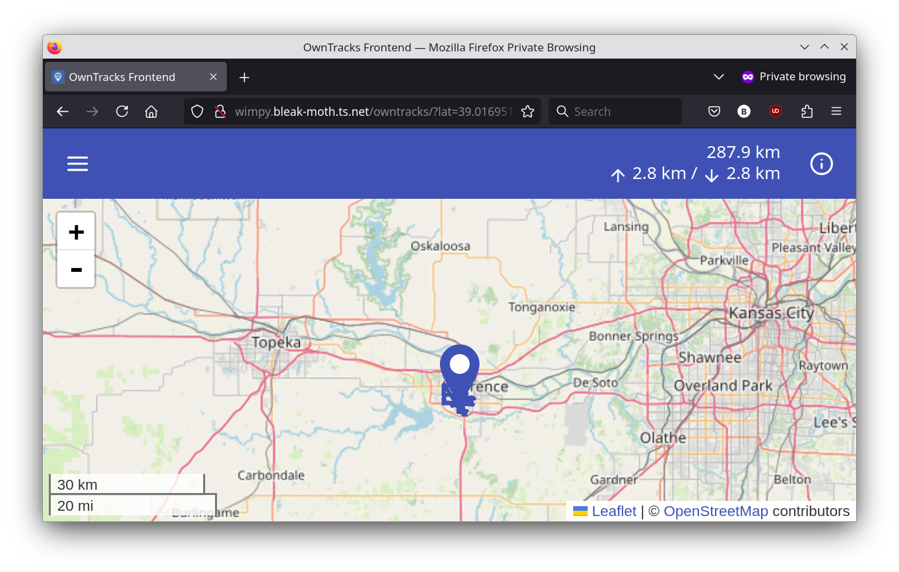
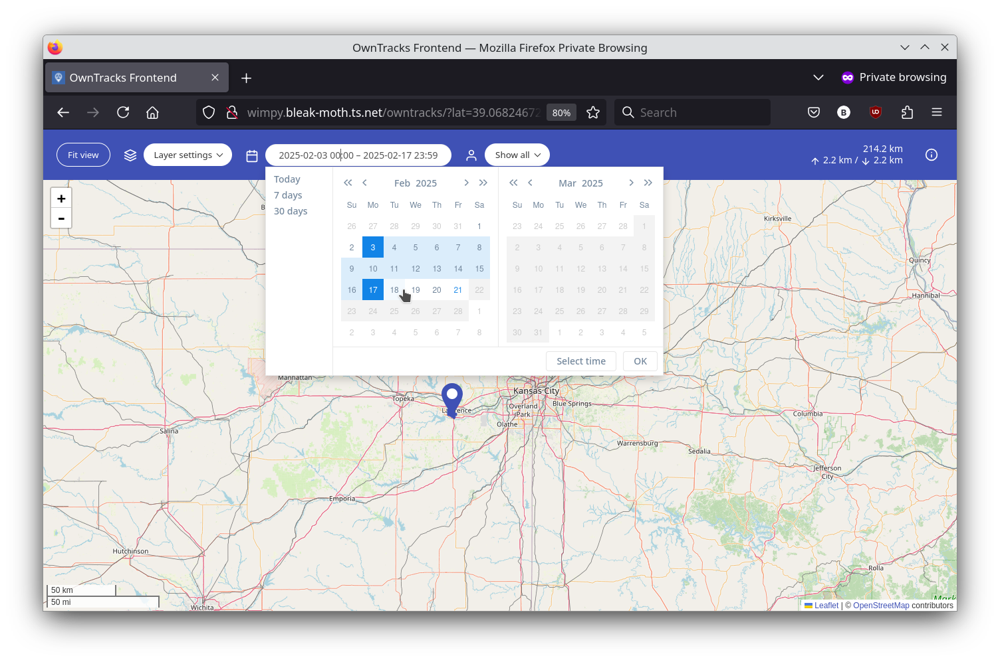

Title: OwnTracks with NixOS and Tailscale
Date: 2025-02-21
Category: self-hosting
Tags: nixos, owntracks, tailscale, degoogle

In an effort to reduce my reliance on big tech I recently decided to
try using [OwnTracks](https://owntracks.org/) to replace Google Maps
Timeline. This article provides a rundown of how I accomplished this
using an existing home server running NixOS and my existing Tailnet.


## Background

For various reasons I find it useful to be able to review my past
whereabouts, and Google Timeline has worked fairly well for this
purpose. At some point Google changed Timeline to only store location
history on the mobile device, removing it from the Maps web app. I've
also found that the UI for Timeline on my phone has become laggy and
feels like it could fail at any time. These seem like warning signs
that Google may be neglecting the service or that it may be dropped
entirely.

To hedge against that possibility and in furtherance of my general
goal of reducing dependence on big tech, I've decided try replacing
this service with OwnTracks.

## OwnTracks

OwnTracks consists of a few components, including mobile apps for
Android and iOS that send location updates to a server. The server can
either be an MQTT broker or the OwnTracks Recorder. Using an MQTT
broker permits live location sharing among devices running the
app. Since I only care about recording my location history, I can
forgo the MQTT broker and set up the app to publish updates directly
to the recorder via HTTP.

The [OwnTracks
Recorder](https://owntracks.org/booklet/clients/recorder/) acts as a
database to store location histories published by the mobile apps. It
also provides APIs for querying the stored histories.

There is also an [OwnTracks
Frontend](https://github.com/owntracks/frontend) which provides a web
app for viewing the stored location histories from the Recorder
service.

## Tailscale

[Tailscale](https://tailscale.com/) is a peer-to-peer VPN
solution. Since I already have Tailscale set up on my home server and
my phone, I can avoid a lot of fiddly work securing (in both senses of
the word) a publicly available IP address for my server. As long as my
phone is connected to my Tailscale VPN, known as a Tailnet, my phone
can directly connect to the server.

## Running the OwnTracks Recorder

I added a systemd service declaration to my NixOS configuration on my
server to run the OwnTracks Recorder service. To avoid running the
service with root privileges I'm using the [dynamic
user](https://noise.getoto.net/2017/10/06/dynamic-users-with-systemd/)
facility provided by systemd which automatically creates an
unprivileged user to run the process. The `StateDirectory` directive
causes a directory to be created under `/var/lib` with permissions
allowing the service to store its persistent state (the location
histories, in this case) across restarts.

Since OwnTracks Recorder has been [packaged for
NixOS](https://github.com/NixOS/nixpkgs/blob/nixos-unstable/pkgs/by-name/ow/owntracks-recorder/package.nix)
I can reference the package directly to invoke the service, and Nix
will automatically make sure it is installed. I'm using the unstable
channel so the package includes [a recent
commit](https://github.com/NixOS/nixpkgs/commit/7ebad821473c78c7cfdf17ecf9f9be91d2455d81)
which fixes the HTTP mode for the service. This is necessary for the
setup to work. The fix should be included in the next stable release
of NixOS.

When the executable is invoked it is provided with the path to the
dynamic user's state directory via the `--storage` flag. The `--port
0` flag tells Recorder not to try to connect to an MQTT broker. I
leave the HTTP port at the default 8083. Other command line options
are in the
[documentation](https://github.com/owntracks/recorder?tab=readme-ov-file#ot-recorder-options).

```nix
  systemd.services.owntracks = {
    enable = true;
    description = "owntracks recorder";
    serviceConfig = {
      ExecStart = ''
        ${pkgs.owntracks-recorder}/bin/ot-recorder \
           --storage /var/lib/owntracks/recorder/store \
           --port 0
        '';
      DynamicUser = true;
      StateDirectory = "owntracks";
      Restart = "always";
    };
    wantedBy = [ "multi-user.target" ];
  };
```

Running `sudo nixos-rebuild switch` will start the Recorder
service. This can be verified by visiting the HTTP endpoint in a
browser. Within my Tailnet my server is reachable at
`wimpy.bleak-moth.ts.net`. Since the Recorder service is using its
default port, I can confirm it is running and available from my
Tailscale connected laptop or phone by visiting
`http://wimpy.bleak-moth.ts.net:8083`. There I will see the minimal
web page the server provides:


## Setting Up the Mobile App

The OwnTracks mobile app can be installed from the Google or Apple app
stores. It needs to be configured to send updates to the recorder by
setting the **Mode** and **Endpoint URL** values in the app's
*Preferences -> Connection* menu. The mode is set to `HTTP` since I'm
not using MQTT. The endpoint URL is set to
`http://wimpy.bleak-moth.ts.net:8083/pub`. This is my server's FQDN
plus the path for publishing updates. I was stuck for awhile due to
not knowing the `/pub` path was required.

{width=200}

As seen above, the *Connection* settings also include
**Identification** and **Credentials** sections. Since the VPN
prevents anyone else from accessing the server, I am not setting up
any sort of access control in the OwnTracks system. Thus the
credentials do not need to be set, but it is worth setting a user name
so that the stored location history will be recorded under that
name. This name will then appear on the maps. Likewise, the values for
**Device ID** and **Tracker ID**.

With the *Connection* settings configured, the mobile app should start
sending location updates to the server. Updates can be manually pushed
by clicking on the upload button in the map header of the app's main
view.

{width=200}

I'm able to confirm the server is receiving location updates by
checking the logs for the OwnTracks Recorder service. Notice the POST
requests to the `/pub` endpoint. These correspond to pushing the
upload button in the app on my phone.


I can also check that locations have been uploaded by opening the
location table link from the server's main web page.


For troubleshooting purposes, the mobile app provides a *Status* menu
with useful information including logs. I found it helpful in getting
the connection established. I think the logs were what clued me into
the `/pub` path.

## Setting Up the Frontend

Once I had my location updates being recorded, it was time to set up
the frontend so that I could view the history. The [OwnTracks
Frontend](https://github.com/owntracks/frontend) is a single page
application that can be served from any webserver. Since I already had
Nginx running and serving static pages out of `/var/www/html/`, it was
pretty easy.

The
[README](https://github.com/owntracks/frontend/blob/main/README.md)
offers instructions to either use Docker or build the app manually,
but I just download the zip archive from the repo's
[releases](https://github.com/owntracks/frontend/releases)
page. Inside, in typical NPM package fashion, is a `dist` directory. I
copied the contents to `/var/www/html/owntracks`.

The app is configured by copying the `config/config.example.js` file
to `config/config.js` and making edits there. For this setup I needed
to set two values. The `api.baseURL` for the OwnTracks Recorder's API
is set to `http://wimpy.bleak-moth.ts.net:8083`. And `router.basePath`
is set to `owntracks` since I'm hosting the app under that path. If
`router.basePath` is not set correctly, the app will load but not
display the map. 

```javascript
// Here you can overwite the default configuration values
window.owntracks = window.owntracks || {};
window.owntracks.config = {
    api: {
        baseUrl: "http://wimpy.bleak-moth.ts.net:8083"
    },
    router: {
        basePath: "owntracks"
    }
};
```

The working frontend looks like the image below and provides options
to view location history for past date-time ranges and with
options for points, lines, and a heatmap. Here I have zoomed the map
way out to avoid advertising my exact location to the Internet.



My use case mostly involves viewing location histories for specific
days. At first I was confused by the UI for selecting dates. The trick
is that you have to select the date range by clicking on the start day
in the calendar and then the end day. If you want just a single day,
you have to click on that day *twice*.



## Conclusion

At this point I have a setup which seems to be working well enough for
my purposes. I've been using it for a few weeks, and I'm able to look
back over my history to see where I was at particular times. There are
a couple of things I would still like to do. First, it seems
like I should be able to write an ad-hoc Nix derivation for the
OwnTracks Frontend so that I can include it declaratively in my NixOS
configuration. This would be preferable to manually downloading and
copying the distribution. Secondly, I'd like my data to be backed
up. I think this should be as simple as setting up
[Borg](https://www.borgbackup.org/) and pointing it at the OwnTracks
Recorder's state directory.
