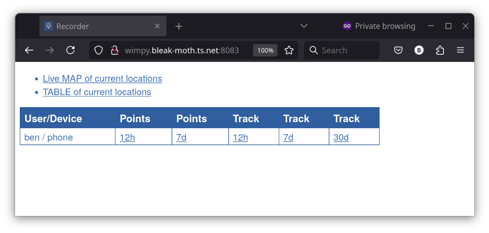
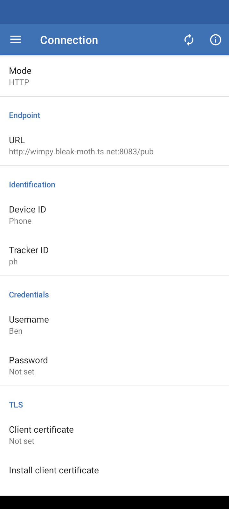

Title: Owntracks with Nixos and Tailscale
Date: 2025-02-15

In an effort to reduce my reliance on big tech I recently decided to
try using [Owntracks](https://owntracks.org/) to replace Google Maps
Timeline. This article provides a rundown of how I accomplished this
using an existing home server running Nixos and my existing Tailnet.


## Impetus

For various reasons I find it useful to be able to review my past
whereabouts, and Google Timeline has worked fairly well for this
purpose. At some point Google changed Timeline to only store location
history on the mobile device, removing it from the Maps web app. I've
also found that the UI for Timeline on my phone has become laggy and
feels like it could fail at any time. These seem like warning signs
that Google may be neglecting the service or that it may be dropped
entirely.

## Owntracks

After researching alternatives, I chose Owntracks somewhat
arbitrarily. It consists of a few components including mobile apps for
Android and iOS that send location updates to a server. The server can
either be an MQTT broker or the Owntracks Recorder. Using an MQTT
broker permits live location sharing among devices running the
app. Since I only care about recording my location history, I can
forgo the MQTT broker and set the app up to publish updates directly
to the recorder via HTTP.

The Owntracks Recorder acts as a database to store location histories
published by the mobile apps. It also provides APIs for querying the
stored histories.

There is also an Owntracks Frontend which provides a web app for
viewing the stored location histories from the Recorder service.

## Tailscale

[Tailscale](TODO) is a .... Since I already have Tailscale set up on
my home server and my phone I can avoid a lot of fiddly work securing,
in both senses of the word, a publicly available IP address for my
server. As long as my phone is connected to my Tailscale VPN, known as
a Tailnet, my phone can directly connect to the server.

## Running the OwnTracks Recorder

I added a systemd service declaration to my Nixos configuration on my
server to run the OwnTracks Recorder service. To avoid running the
service with root privileges I'm using the [dynamic user](TODO)
facility provided by systemd which automatically creates an
unprivileged user to run the process. The `StateDirectory` directive
causes a directory to be created under `/var/lib` with permissions
allowing the service to store its persistent state (the location
histories in this case) across restarts.

Since OwnTracks Recorder has been packaged for NixOS I can reference
the package directly to invoke the service. I provide the path to the
state directory in `--storage` flag. The `--port 0` flag tells Record
not to try to connect to an MQTT broker. I leave the HTTP port at the
[default](TODO) of 8083.

```nix
  systemd.services.owntracks = {
    enable = true;
    description = "owntracks recorder";
    serviceConfig = {
      ExecStart = ''
        ${pkgs.owntracks-recorder}/bin/ot-recorder \
           --storage /var/lib/owntracks/recorder/store \
           --port 0
        '';
      DynamicUser = true;
      StateDirectory = "owntracks";
      Restart = "always";
    };
    wantedBy = [ "multi-user.target" ];
  };
```

Within my Tailnet, my home server has the FQDN,
`wimpy.bleak-moth.ts.net`. With the Recorder service running on its
default port, I can confirm its reachability from my Tailscale
connected laptop by visiting `http://wimpy.bleak-moth.ts.net:8083`.



## Setting Up the Mobile App

The [OwnTracks mobile app](TODO) can be installed from the app
store. It needs to be configured to send updates to the recorder by
setting **Mode** to `HTTP` and the **Endpoint URL** to the path `/pub`
at the recorder's host address in the app's preferences menu. In my
case the **Endpoint URL** is
`http://wimpy.bleak-moth.ts.net:8083/pub`.

TODO Fix image.
{width=400}

TODO about Identity and Credentials.
TODO about manually sending update.
TODO about modes.
TODO about status and errors.


## Setting Up the Frontend

TODO

## Next Steps

TODO about Nixos config.
